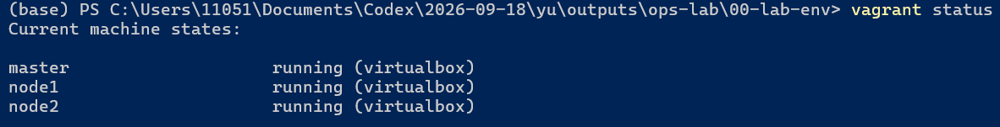
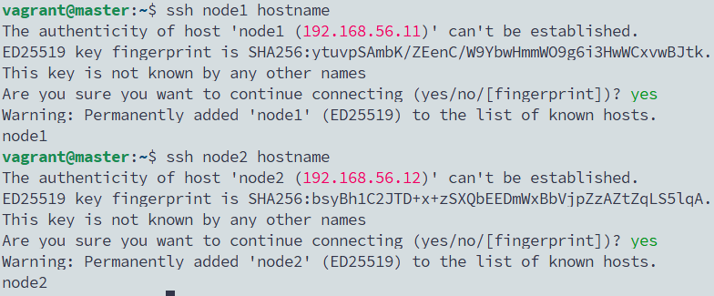
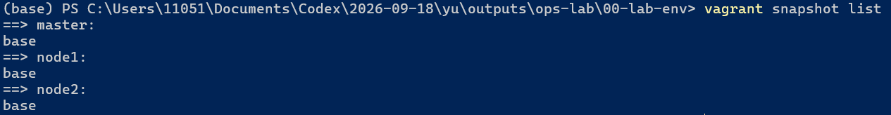

# 00 · 用 Vagrant 搭建 3 节点实验环境

> 状态：✅ 已跑通（2026-09-30）

## 目标
一条命令创建 3 台可互相用主机名访问的 Ubuntu 虚拟机，master 能免密 SSH 到两台 node，并保存一个干净快照，后面任何实验搞坏了都能一键还原。

**为什么用 Vagrant 而不是在 VirtualBox 里手点：** 环境写成代码（`Vagrantfile`），坏了能删掉重建，配置能放进 Git——这就是“基础设施即代码”的最小版本。

## 环境

| 主机 | IP | 系统 | 默认内存 / k8s 档 | 角色 |
|------|----|------|-------------------|------|
| master | 192.168.56.10 | Ubuntu 22.04 | 1G / 4G | 控制节点（跑 Ansible、K8s 控制面） |
| node1 | 192.168.56.11 | Ubuntu 22.04 | 1G / 2.5G | 工作节点 |
| node2 | 192.168.56.12 | Ubuntu 22.04 | 1G / 2.5G | 工作节点 |

- 网卡 1：NAT（上网用）；网卡 2：Host-Only `192.168.56.0/24`（三台机器和宿主机互通）
- 宿主机：Windows 11 Home，16GB，VirtualBox + Vagrant 2.4.9
- 文件：[Vagrantfile](Vagrantfile)、[provision.sh](provision.sh)（首次启动自动配置 hosts、阿里云源、时区、常用工具）

## 步骤

### 1. 启动
在 Windows PowerShell 中：
```powershell
cd C:\Users\11051\Documents\Codex\2026-09-18\yu\outputs\ops-lab\00-lab-env
vagrant up
vagrant status
```
第一次会依次创建 master、node1、node2 并执行 provision.sh，大约 5–10 分钟。

> 📸 截图：`vagrant status` 显示 3 台都是 `running`


### 2. 验证网络
> 登录某台机器有两种方式，任选其一：Termius 打开对应标签页（见第 6 步），或在 `00-lab-env` 目录执行 `vagrant ssh 名字`。下文只写“在 xx 上”。

在 master 上：
```bash
ping -c 2 node1 #2表示master向node1发送2个数据包就停止ping
ping -c 2 node2
ping -c 2 mirrors.aliyun.com   # master能上网
```

### 3. 配置 master → node 免密 SSH
**原理：** master 生成一对密钥，私钥留在 master，公钥放进 node 的 `~/.ssh/authorized_keys`；之后 master 登录 node 时用私钥证明身份，不需要密码。Ansible 就靠这个管理机器。

在 **master** 上：
```bash
ssh-keygen -t ed25519 -N "" -f ~/.ssh/id_ed25519 #ed25519（现代安全算法）
mkdir -p /vagrant/.keys #vagrant 是共享目录
cp ~/.ssh/id_ed25519.pub /vagrant/.keys/master.pub
```
`/vagrant` 是共享文件夹，对应宿主机的 `00-lab-env` 目录，三台机器都能看到，用它来传公钥。`.keys/` 已加入 `.gitignore`，不会提交。

分别在 **node1**、**node2** 上：
```bash
cat /vagrant/.keys/master.pub >> ~/.ssh/authorized_keys
chmod 600 ~/.ssh/authorized_keys
```

回到 **master** 验证：
```bash
ssh node1 hostname    # 第一次会问 yes/no，输入 yes
ssh node2 hostname
```
输出分别是 `node1`、`node2`，且没有要求输入密码，即成功。

> 📸 截图：master 上 `ssh node1 hostname` 和 `ssh node2 hostname` 的输出


### 4. 保存干净快照
```powershell
vagrant snapshot save base
vagrant snapshot list
```
之后任何实验搞乱了：`vagrant snapshot restore base` 一键回到这里。

> 📸 截图：`vagrant snapshot list` 显示三台都有 `base`


### 5. 切换内存档位（做 K8s / ELK 时再用）
```powershell
$env:LAB_PROFILE="k8s"; vagrant reload     # 切到 k8s 档
$env:LAB_PROFILE="light"; vagrant reload   # 切回默认
```
`$env:` 只在当前 PowerShell 窗口有效，新开窗口默认是 light。

### 6. 用 SSH 工具连接（Termius）
比 `vagrant ssh` 方便：3 台各开一个标签页，自带 SFTP 传文件。每台新建一个 Host：

| 字段 | 填写 |
|------|------|
| Address | `192.168.56.10` / `.11` / `.12` |
| Port | 22 |
| Username | `vagrant`（Password 留空） |
| Key | Import `00-lab-env\.vagrant\machines\<名字>\virtualbox\private_key` |

`vagrant destroy` 重建后私钥会变，需重新导入。

**两套密钥别搞混：**

| 密钥 | 谁生成 | 用途 |
|------|--------|------|
| `.vagrant\machines\<名字>\virtualbox\private_key` | 首次 `vagrant up` 时 Vagrant 自动生成，每台一把 | Windows → 虚拟机（Termius、`vagrant ssh`） |
| master 的 `~/.ssh/id_ed25519` | 第 3 步手动 `ssh-keygen` | master → node1/node2（Ansible 用） |

> ⚠️ 登录时提示 `New release '24.04' available`，**不要**执行 `do-release-upgrade`：三台系统版本要保持一致，后续文档都按 22.04 写。

## 验证清单
- [x] `vagrant status` 三台 running
- [x] master 能 `ping node1`、`ping node2`、能上网
- [x] master `ssh node1 hostname` 不要密码
- [x] `vagrant snapshot list` 有 base
- [x] Termius 能分别登录 3 台

## 常用命令速查

| 命令 | 作用 |
|------|------|
| `vagrant up [名字]` | 启动（首次会创建） |
| `vagrant halt` | 关机，释放内存 |
| `vagrant suspend` / `resume` | 休眠 / 唤醒 |
| `vagrant ssh 名字` | 登录某台 |
| `vagrant reload` | 重启并应用 Vagrantfile 修改 |
| `vagrant provision` | 重新执行 provision.sh |
| `vagrant snapshot save/restore/list 名称` | 快照 |
| `vagrant destroy -f` | 彻底删除三台（Vagrantfile 还在，可重建） |

## 踩坑记录
| 现象 | 原因 | 解决 |
|------|------|------|
| | | |

（遇到报错把完整输出贴给 Claude，修正后记到这里）

## 回滚 / 清理
```powershell
vagrant snapshot restore base   # 回到干净状态
vagrant destroy -f              # 全部删除
```

## 简历表述
> 使用 Vagrant 以代码方式管理多节点实验环境，支持内存档位切换与快照回滚，可一键重建。
