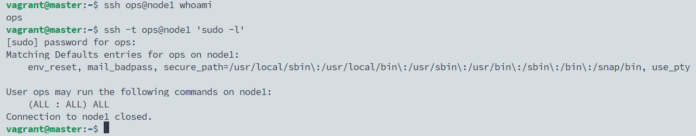
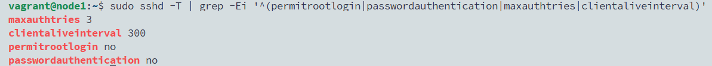
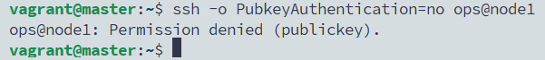
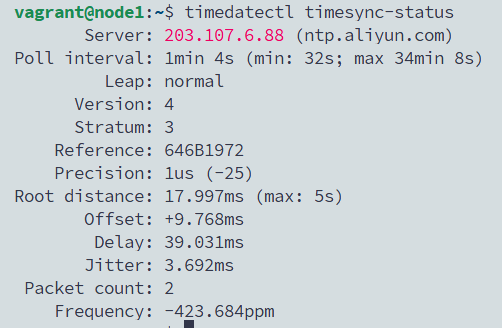
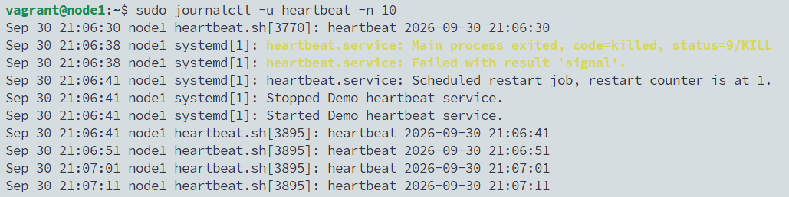

# 01 · 系统初始化：用户、SSH 加固、防火墙、时间同步、systemd

> 状态：✅ 已跑通（2026-09-30）

## 目标
把一台“刚装好的”服务器初始化成可以上线的状态：有专用运维账号、SSH 只允许密钥登录、防火墙只放行需要的端口、时间准确，并能把自己的程序托管成开机自启、崩溃自动拉起的系统服务。

**为什么重要：** 这是每台新服务器上线前的标准动作，也是面试里“拿到一台新机器你会做什么”的标准答案。

**本实验只在 node1 上手动做**，理解每一步。三台批量做放到实验 06（Ansible）。

## 环境
- node1（192.168.56.11），Ubuntu 22.04，默认 light 档即可
- master 用于从外部验证 SSH、防火墙
- 开始前 node1 处于 `base` 快照的干净状态

## 步骤

### 1. 先看清这台机器
在 **node1** 上：
```bash
hostnamectl          # 主机名、系统版本、内核
free -h              # 内存
df -h                # 磁盘
ip -br a             # 网卡和 IP
uptime               # 运行时间和负载
```
**为什么：** 动手改任何东西前先摸底，出问题时才知道“原来是什么样”。

### 2. 创建运维账号 ops
**为什么：** 不用共享账号（vagrant / root）干活，每个人用自己的账号，操作可追溯；需要特权时用 `sudo`，而不是直接登录 root。

在 **node1** 上：
```bash
sudo useradd -m -s /bin/bash ops     # -m 建家目录，-s 指定 shell
sudo passwd ops                      # 设置密码（sudo 时要用）;密码也是ops
sudo usermod -aG sudo ops            # 加入 sudo 组，获得管理员权限
id ops                               # 确认：groups 里有 sudo
```

给 ops 配上 master 的公钥（和实验 00 同一把），让 master 能以 ops 身份免密登录：
```bash
sudo mkdir -p /home/ops/.ssh
sudo cp /vagrant/.keys/master.pub /home/ops/.ssh/authorized_keys
sudo chown -R ops:ops /home/ops/.ssh
sudo chmod 700 /home/ops/.ssh
sudo chmod 600 /home/ops/.ssh/authorized_keys
```
**权限为什么这么严：** SSH 发现 `.ssh` 目录或 `authorized_keys` 别人可写，会直接拒绝密钥登录——这是最常见的“配了公钥还要密码”的原因。

在 **master** 上验证：
```bash
ssh ops@node1 whoami           # 输出 ops
ssh -t ops@node1 'sudo -l'     # -t 分配终端才能输密码；输入 ops 的密码，能列出 (ALL : ALL) ALL 即有 sudo 权限
```

> 📸 截图：master 上 `ssh ops@node1 whoami` 输出 `ops`


### 3. SSH 加固
**目标：** 禁止 root 登录、禁止密码登录（只认密钥）、限制尝试次数、断开长时间无响应的连接。

**先看懂配置怎么生效：** Ubuntu 22.04 的 `/etc/ssh/sshd_config` 第一行附近有 `Include /etc/ssh/sshd_config.d/*.conf`；sshd 对同一个参数**只认第一次出现的值**，文件按名字排序读取。所以我们的加固文件起名 `10-` 开头，保证比系统自带的 `60-cloudimg-settings.conf` 先读到。

在 **node1** 上：
```bash
ls /etc/ssh/sshd_config.d/                 # 看看已有哪些配置
sudo tee /etc/ssh/sshd_config.d/10-hardening.conf >/dev/null <<'EOF'
PermitRootLogin no
PasswordAuthentication no
MaxAuthTries 3
ClientAliveInterval 300
ClientAliveCountMax 2
EOF
sudo sshd -t && echo "config OK"           # 语法检查，没输出错误才继续
sudo systemctl restart ssh
```

> ⚠️ **改 SSH 的铁律：** 重启前一定 `sshd -t`；重启后**不要关掉当前窗口**，另开一个窗口确认还能登录，再关旧窗口。否则配置写错就把自己锁在外面了。
> 端口不要改：Vagrant 靠 22 端口转发，改了 `vagrant ssh` 会连不上。

验证最终生效的值：
```bash
sudo sshd -T | grep -Ei '^(permitrootlogin|passwordauthentication|maxauthtries|clientaliveinterval)'
```
预期：`permitrootlogin no`、`passwordauthentication no`、`maxauthtries 3`、`clientaliveinterval 300`。

在 **master** 上验证密码登录已被拒绝：
```bash
ssh -o PubkeyAuthentication=no ops@node1
```
预期输出 `Permission denied (publickey)`——服务器根本不给输密码的机会。

（Vagrant 的 Ubuntu 镜像默认已关闭密码登录，所以改之前也是这个结果。我们仍然显式写进 `10-hardening.conf`：基线要写明、可审计，不依赖镜像默认值。）

> 📸 截图：`sshd -T` 的四行结果 + master 上 `Permission denied (publickey)`



### 4. 防火墙 ufw
**原理：** 默认拒绝所有进入的连接，只按需放行。`ufw` 是 Ubuntu 上对 iptables/nftables 的简化封装（CentOS/RHEL 上对应 `firewalld`）。

> ⚠️ **必须先放行 SSH 再启用防火墙**，否则当前连接会被切断。

在 **node1** 上：
```bash
sudo ufw default deny incoming
sudo ufw default allow outgoing
sudo ufw allow OpenSSH             # 放行 22 端口
sudo ufw enable                    # 提示 y/n 时输入 y
sudo ufw status verbose
```

**动手验证防火墙真的在拦：** 在 node1 上临时起一个 8080 端口的 Web 服务：
```bash
python3 -m http.server 8080
```
保持运行，到 **master** 上：
```bash
nc -zv -w 3 node1 8080             # 预期：超时失败（被防火墙拦了）
```
回到 **node1**，`Ctrl+C` 停掉服务，放行 8080（只允许内网网段）后再起：
```bash
sudo ufw allow from 192.168.56.0/24 to any port 8080 proto tcp
python3 -m http.server 8080
```
再到 **master**：
```bash
nc -zv -w 3 node1 8080             # 预期：succeeded
```
验证完回到 node1，`Ctrl+C` 停服务，删掉这条临时规则：
```bash
sudo ufw status numbered           # 找到 8080 那条的编号
sudo ufw delete <编号>
```

> 📸 截图：master 上 8080 放行前失败、放行后 succeeded 的两次 `nc` 输出


### 5. 时间同步
**为什么：** 多台机器时间不一致，会导致日志对不上、证书校验失败、K8s / etcd 集群出错。

Ubuntu 默认用 `systemd-timesyncd` 同步时间（RHEL 系常用 `chrony`，原理相同）。改成国内的阿里云 NTP 服务器：

在 **node1** 上：
```bash
sudo sed -i 's/^#\?NTP=.*/NTP=ntp.aliyun.com/' /etc/systemd/timesyncd.conf
sudo systemctl restart systemd-timesyncd
timedatectl                        # System clock synchronized: yes；NTP service: active
timedatectl timesync-status        # Server 一行应显示 ntp.aliyun.com 的地址
```
刚重启时可能还没同步上，等几十秒再看一次。

> 📸 截图：`timedatectl timesync-status` 显示已连上阿里云 NTP


### 6. 用 systemd 托管自己的程序
**为什么：** 生产环境的程序不能靠“在终端里跑着”——关窗口就停，崩了也没人管。交给 systemd 后：开机自启、崩溃自动重启、日志统一进 journal。

在 **node1** 上写一个每 10 秒打一行日志的小程序：
```bash
sudo tee /usr/local/bin/heartbeat.sh >/dev/null <<'EOF'
#!/usr/bin/env bash
while true; do
  echo "heartbeat $(date '+%F %T')"
  sleep 10
done
EOF
sudo chmod +x /usr/local/bin/heartbeat.sh
```

写 unit 文件，告诉 systemd 怎么管它：
```bash
sudo tee /etc/systemd/system/heartbeat.service >/dev/null <<'EOF'
[Unit]
Description=Demo heartbeat service
After=network.target

[Service]
ExecStart=/usr/local/bin/heartbeat.sh
User=ops
Restart=always
RestartSec=3

[Install]
WantedBy=multi-user.target
EOF
```
| 配置 | 含义 |
|------|------|
| `After=network.target` | 网络就绪后再启动 |
| `User=ops` | 用普通用户运行，不用 root |
| `Restart=always` + `RestartSec=3` | 进程退出 3 秒后自动拉起 |
| `WantedBy=multi-user.target` | `enable` 后开机自启 |

启动并设为开机自启：
```bash
sudo systemctl daemon-reload                 # 新增/修改 unit 文件后必须执行
sudo systemctl enable --now heartbeat        # enable=开机自启，--now=立即启动
systemctl status heartbeat                   # Active: active (running)
sudo journalctl -u heartbeat -n 5            # 看最近 5 行日志（系统服务日志要 sudo 才能看）
```

**模拟崩溃，看它自动恢复：**
```bash
sudo kill -9 $(systemctl show -p MainPID --value heartbeat)
sleep 5
systemctl status heartbeat                   # 又是 active (running)，PID 变了
sudo journalctl -u heartbeat -n 10           # 能看到 killed 和重新 Started 的记录
```

> 📸 截图：`sudo journalctl -u heartbeat -n 10` 中被 kill 后自动重启的记录


## 故障演练（选做，推荐）
**场景：** SSH 配置写错了。

在 node1 上故意写错一行，然后做语法检查：
```bash
echo "PermitRootLogin maybe" | sudo tee /etc/ssh/sshd_config.d/20-broken.conf
sudo sshd -t
```
`sshd -t` 会直接指出哪个文件哪一行错了——这就是为什么重启前必须先检查。删掉错误文件：
```bash
sudo rm /etc/ssh/sshd_config.d/20-broken.conf
sudo sshd -t && echo "config OK"
```
按 [故障模板](../_templates/incident.md) 在 `troubleshooting/` 写一篇复盘。

## 验证清单
- [x] master 上 `ssh ops@node1 whoami` 输出 ops，且 ops 有 sudo 权限
- [x] `sshd -T` 显示禁止 root、禁止密码登录
- [x] master 用密码方式登录被拒绝 `Permission denied (publickey)`
- [x] `ufw status` 为 active，只放行 OpenSSH；8080 实验放行前后结果不同
- [x] `timedatectl` 显示已同步
- [x] heartbeat 服务被 kill 后自动恢复

## 排障命令速查

| 想知道什么 | 命令 |
|------------|------|
| CPU / 内存占用最高的进程 | `top`（按 M 按内存排序）、`ps aux --sort=-%mem \| head` |
| 内存、磁盘 | `free -h`、`df -h`、`du -sh /var/log/*` |
| 哪些端口在监听、被谁占用 | `ss -tlnp`、`sudo lsof -i :80` |
| 服务状态和日志 | `systemctl status 服务名`、`sudo journalctl -u 服务名 -f` |
| 系统日志 | `sudo journalctl -xe`、`tail -f /var/log/syslog` |
| 网络通不通 | `ping`、`nc -zv 主机 端口`、`curl -v URL` |
| 域名解析 | `dig 域名`、`cat /etc/hosts` |
| 路由 | `ip r` |
| 防火墙规则 | `sudo ufw status numbered` |

## 踩坑记录
| 现象 | 原因 | 解决 |
|------|------|------|
| `journalctl -u heartbeat` 显示 Hint 和 -- No entries -- | vagrant 用户不在 adm / systemd-journal 组，只能看自己的日志，看不到系统服务日志 | 加 `sudo`；或 `sudo usermod -aG systemd-journal $USER` 后重新登录 |

（遇到报错把完整输出贴给 Claude，修正后记到这里）

## 回滚 / 清理
在 Windows PowerShell 的 `00-lab-env` 目录：
```powershell
vagrant snapshot restore node1 base    # 只把 node1 恢复到干净状态
```

## 简历表述
> 制定 Linux 服务器初始化基线：专用运维账号与 sudo 授权、SSH 仅密钥登录并禁用 root、ufw 最小端口放行、NTP 时间同步，并使用 systemd 托管业务进程实现开机自启与崩溃自动恢复。
