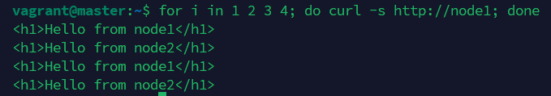
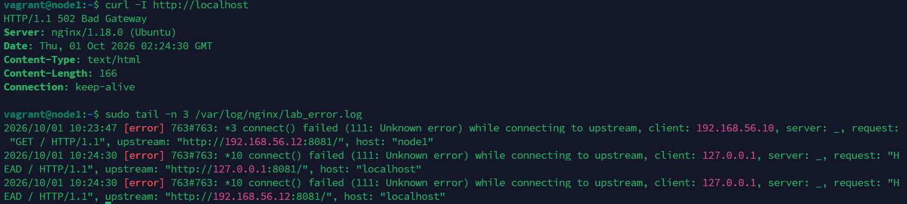
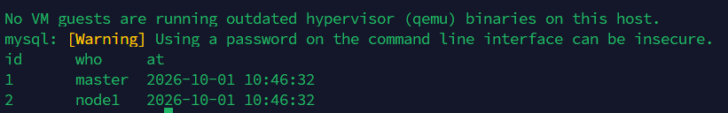
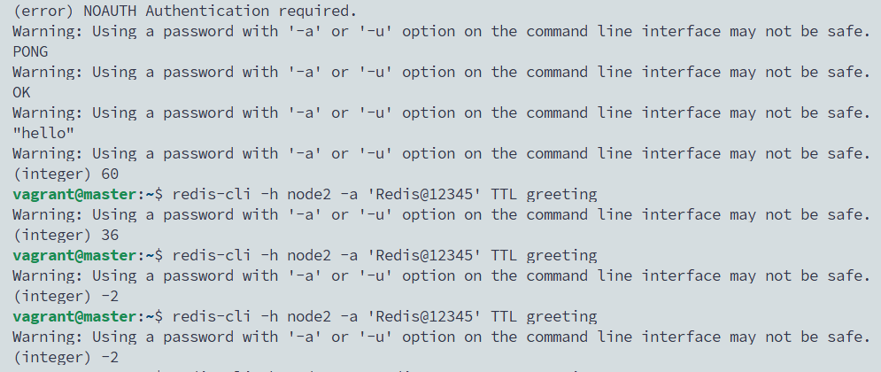

# 02 · 手动部署 Nginx + MySQL + Redis，并做反向代理

> 状态：✅ 已跑通（2026-10-01）

## 目标
亲手装好运维最常打交道的三个中间件，并搭出一个最小的“入口 → 后端 → 数据”结构：

```
Windows 浏览器 / master
        │ :80
        ▼
  node1  Nginx（反向代理 + 负载均衡）
        │ :8081
   ┌────┴─────┐
   ▼          ▼
node1 后端   node2 后端          node2  MySQL :3306 / Redis :6379
```

**为什么重要：** 国内运维面试必问 Nginx / MySQL / Redis 的安装、配置、远程访问、日志和常见报错（502、Access denied、NOAUTH）。这些都在本实验里亲手碰一遍。

## 环境
| 主机 | 本实验装什么 |
|------|--------------|
| node1 | Nginx、一个简易后端（已完成实验 01，**有 ufw 防火墙**） |
| node2 | 一个简易后端、MySQL 8.0、Redis |
| master | MySQL / Redis 客户端，用来远程验证 |

默认 light 档（每台 1G）即可。

> 本文档里的密码 `App@12345`、`Redis@12345` 仅用于实验，**不要在任何真实环境使用**。

---

## A. Nginx：反向代理 + 负载均衡

### A1. 安装并访问默认页（node1）
```bash
sudo apt-get install -y nginx
systemctl status nginx          # active (running)
curl -I http://localhost        # HTTP/1.1 200 OK
sudo ufw allow 'Nginx HTTP'     # 实验 01 开了防火墙，要放行 80
```
在 Windows 浏览器打开 `http://192.168.56.11`，能看到 “Welcome to nginx!”。

**记住这几个位置：**
| 路径 | 作用 |
|------|------|
| `/etc/nginx/nginx.conf` | 主配置 |
| `/etc/nginx/sites-available/` | 站点配置存放处 |
| `/etc/nginx/sites-enabled/` | 生效的站点（指向上面的软链接） |
| `/var/log/nginx/access.log`、`error.log` | 访问日志、错误日志 |

### A2. 准备两个后端（node1 和 node2 各做一次）
用 Python 自带的 Web 服务当“业务程序”，页面上显示自己的主机名，方便看出请求被转到了哪台。并用实验 01 学的 systemd 托管它。

在 **node1**、**node2** 上都执行：
```bash
sudo mkdir -p /srv/web
echo "<h1>Hello from $(hostname)</h1>" | sudo tee /srv/web/index.html

sudo tee /etc/systemd/system/web-backend.service >/dev/null <<'EOF'
[Unit]
Description=Lab web backend
After=network.target

[Service]
ExecStart=/usr/bin/python3 -m http.server 8081 --directory /srv/web
User=www-data
Restart=always

[Install]
WantedBy=multi-user.target
EOF

sudo systemctl daemon-reload
sudo systemctl enable --now web-backend
sleep 2                         # 等进程开始监听端口，否则整段粘贴时 curl 会 Connection refused
curl http://localhost:8081      # 输出 Hello from 本机名
```

### A3. 配置反向代理和负载均衡（node1）
**反向代理：** 用户只访问 Nginx，由 Nginx 把请求转给后端——后端不直接暴露，还能在一处统一做 HTTPS、限流、日志。
**负载均衡：** `upstream` 里写多个后端，Nginx 默认轮流转发（轮询）。

```bash
sudo tee /etc/nginx/sites-available/lab.conf >/dev/null <<'EOF'
upstream backend {
    server 127.0.0.1:8081;          # node1 自己的后端
    server 192.168.56.12:8081;      # node2 的后端
}

server {
    listen 80 default_server;
    server_name _;

    access_log /var/log/nginx/lab_access.log;
    error_log  /var/log/nginx/lab_error.log;

    location / {
        proxy_pass http://backend;
        proxy_set_header Host              $host;
        proxy_set_header X-Real-IP         $remote_addr;
        proxy_set_header X-Forwarded-For   $proxy_add_x_forwarded_for;
        proxy_connect_timeout 2s;
    }

    # Nginx 自身状态，后面 Prometheus 实验会用到
    location /nginx_status {
        stub_status;
        allow 127.0.0.1;
        deny all;
    }
}
EOF

sudo rm /etc/nginx/sites-enabled/default
sudo ln -s /etc/nginx/sites-available/lab.conf /etc/nginx/sites-enabled/
sudo nginx -t                   # 语法检查，必须 successful 才继续
sudo systemctl reload nginx     # reload：不断开现有连接地加载新配置
```

| 配置 | 含义 |
|------|------|
| `proxy_set_header X-Real-IP` | 把真实访客 IP 告诉后端，否则后端只看到 Nginx 的 IP |
| `proxy_connect_timeout 2s` | 连后端超过 2 秒算失败，换下一台 |
| `nginx -t` | 和 `sshd -t` 一样：**改完先检查再生效** |

在 **master** 上验证轮询：
```bash
for i in 1 2 3 4; do curl -s http://node1; done
```
预期 node1、node2 交替出现。

> 📸 截图：master 上 4 次 curl，node1 / node2 交替


### A4. 故障切换与 502 
**一台后端挂了：** 在 **node2** 上：
```bash
sudo systemctl stop web-backend
```
回到 **master** 再跑 4 次 curl：全部返回 node1，**用户无感知**——Nginx 发现 node2 连不上，自动把请求重试到 node1。

**全部后端都挂了：** 在 **node1** 上也停掉：
```bash
sudo systemctl stop web-backend
curl -I http://localhost                     # HTTP/1.1 502 Bad Gateway
sudo tail -n 3 /var/log/nginx/lab_error.log  # connect() failed (111: Connection refused) while connecting to upstream
```
**502 的含义：** Nginx 自己是好的，但它身后的后端连不上。排查方向永远是“看 error.log → 查后端进程和端口”。

> 📸 截图：502 响应 + error.log 里的 `Connection refused`


恢复两台后端：
```bash
sudo systemctl start web-backend      # node1、node2 各执行一次
```

---

## B. MySQL 8.0（node2）

### B1. 安装
```bash
sudo apt-get install -y mysql-server
systemctl status mysql              # active (running)
sudo mysql -e "SELECT VERSION();"   # 8.0.x
```
**为什么 `sudo mysql` 不用密码：** Ubuntu 上 MySQL 的 root 默认用 `auth_socket` 认证——只要你是系统的 root，就能进 MySQL 的 root。它不能远程登录，所以是安全的。

| 路径 | 作用 |
|------|------|
| `/etc/mysql/mysql.conf.d/mysqld.cnf` | 服务端配置 |
| `/var/lib/mysql/` | 数据目录 |
| `/var/log/mysql/error.log` | 错误日志 |

### B2. 建库、建业务账号
**原则：** 应用永远用只对自己库有权限的专用账号，不用 root。

```bash
sudo mysql <<'EOF'
CREATE DATABASE labdb DEFAULT CHARACTER SET utf8mb4;
CREATE USER 'app'@'192.168.56.%' IDENTIFIED BY 'App@12345';
GRANT ALL PRIVILEGES ON labdb.* TO 'app'@'192.168.56.%';
SELECT user, host FROM mysql.user;
EOF
```
`'app'@'192.168.56.%'` 的意思：用户 app **只能从 192.168.56.x 网段**登录。MySQL 里“用户名 + 来源地址”才是一个完整账号。

### B3. 开放远程访问
MySQL 默认只监听 127.0.0.1，外面连不进来：
```bash
ss -tlnp | grep 3306                     # 127.0.0.1:3306
sudo sed -i 's/^bind-address.*/bind-address = 0.0.0.0/' /etc/mysql/mysql.conf.d/mysqld.cnf
sudo systemctl restart mysql
ss -tlnp | grep 3306                     # 0.0.0.0:3306
```

### B4. 从 master 远程读写
在 **master** 上：
```bash
sudo apt-get install -y mysql-client
mysql -h node2 -u app -p'App@12345' labdb <<'EOF'
CREATE TABLE visit (id INT AUTO_INCREMENT PRIMARY KEY, who VARCHAR(50), at DATETIME DEFAULT NOW());
INSERT INTO visit (who) VALUES ('master'), ('node1');
SELECT * FROM visit;
EOF
```
（命令行里写密码会有 `Using a password on the command line interface can be insecure` 警告，实验里忽略；生产用配置文件或交互输入。）

> 📸 截图：master 远程执行后 `SELECT * FROM visit` 的结果


**远程连不上时按顺序查（面试高频）：**
1. `ss -tlnp | grep 3306` —— 是不是只监听 127.0.0.1（bind-address）
2. `nc -zv node2 3306` —— 网络/防火墙通不通
3. `SELECT user,host FROM mysql.user` —— 账号的 host 是否允许你的来源 IP
4. `/var/log/mysql/error.log` —— 服务本身有没有报错

---

## C. Redis（node2）

### C1. 安装
```bash
sudo apt-get install -y redis-server
systemctl status redis-server
redis-cli ping                  # PONG
```

### C2. 开放远程访问并设置密码
```bash
sudo sed -i 's/^bind 127.0.0.1 ::1/bind 127.0.0.1 192.168.56.12/' /etc/redis/redis.conf
sudo sed -i 's/^# requirepass .*/requirepass Redis@12345/' /etc/redis/redis.conf
sudo grep -E '^(bind|requirepass)' /etc/redis/redis.conf   # 确认改成功
sudo systemctl restart redis-server
ss -tlnp | grep 6379            # 192.168.56.12:6379
```
**为什么必须设密码：** Redis 没密码又对外开放，是真实世界里服务器被入侵（写入挖矿程序）的经典原因。

### C3. 从 master 远程使用
在 **master** 上：
```bash
sudo apt-get install -y redis-tools
redis-cli -h node2 ping                          # (error) NOAUTH Authentication required.
redis-cli -h node2 -a 'Redis@12345' ping         # PONG
redis-cli -h node2 -a 'Redis@12345' SET greeting "hello" EX 60   # 60 秒后过期
redis-cli -h node2 -a 'Redis@12345' GET greeting
redis-cli -h node2 -a 'Redis@12345' TTL greeting                 # 剩余秒数
```
`EX 60` 就是缓存的核心用法：数据放一段时间自动失效。

> 📸 截图：NOAUTH 报错、PONG、GET 和 TTL 的输出


### C4. 持久化：重启后数据还在吗
```bash
redis-cli -h node2 -a 'Redis@12345' SET keep "i survive"
```
到 **node2**：`sudo systemctl restart redis-server`，再回 **master**：
```bash
redis-cli -h node2 -a 'Redis@12345' GET keep     # "i survive"
```
Redis 数据在内存里，但默认会用 **RDB 快照**定期存到磁盘（`/var/lib/redis/dump.rdb`），正常关闭时也会保存，所以重启不丢。另一种方式 **AOF** 记录每条写命令，更安全但文件更大——面试常问两者区别。

---

## 验证清单
- [x] 浏览器能打开 `http://192.168.56.11`
- [x] master 连续 curl，node1 / node2 交替
- [x] 停一台后端，访问不受影响；全停出现 502，error.log 有 `Connection refused`
- [x] master 能用 app 账号远程读写 labdb
- [x] master 不带密码访问 Redis 报 NOAUTH，带密码正常；重启后 keep 仍在

## 故障演练（选做，推荐）
1. **MySQL 远程拒绝：** 把 `bind-address` 改回 `127.0.0.1` 并重启，从 master 连接，看报什么错；按上面“按顺序查”的 4 步定位。
2. **Nginx 配置写错：** 在 `lab.conf` 里删掉一个分号，执行 `sudo nginx -t` 看提示。

每个按 [故障模板](../_templates/incident.md) 在 `troubleshooting/` 写一篇复盘。

## 踩坑记录
| 现象 | 原因 | 解决 |
|------|------|------|
| 整段粘贴 A2 后 `curl localhost:8081` 报 Connection refused | 服务刚启动，Python 还没开始监听端口，curl 执行得太快 | 稍等再 curl；文档已加 `sleep 2` |
| Termius 连 master 报 `Connection closed with error: end of file`（TCP 已连上，SSH 握手前断开） | 1GB 内存被耗尽，sshd 无法 fork 新会话 | 多次重启 VM 后恢复；预防：加 2GB swap，必要时 VM 内存调到 2GB |
| node2 装 MySQL 停在 `mysqld is running as pid ...`，另开终端也 SSH 不上 | MySQL 8 初始化吃满 1GB 内存；同时 needrestart 弹窗在等确认 | 等待/在 VirtualBox 控制台操作；卡死则重置后 `sudo dpkg --configure -a`；MySQL 设 `innodb_buffer_pool_size=128M`、`performance_schema=OFF` |
| apt 装完弹出 Pending kernel upgrade / Daemons using outdated libraries | Ubuntu 22.04 的 needrestart：之前升级了内核但未重启 | 回车选默认 OK；空闲时 `sudo reboot`；改 `/etc/needrestart/needrestart.conf` 设 `$nrconf{restart}='a'` 免交互（Ansible 批量装也需要） |
| `systemctl status` 输出后"卡住"，底部显示 `lines 1-12/12 (END)` | 进入了 less 分页器，不是卡死 | 按 `q` 退出；或加 `--no-pager` |
| Redis 装到了 master 上 | 没看清节点 | `sudo apt purge -y redis-server redis-tools && sudo apt autoremove -y`，再删 `/var/lib/redis` |
| `grep ... /etc/redis/redis.conf` 报 Permission denied | redis.conf 权限 640，属主 redis，普通用户不可读 | 加 `sudo`；文档已修正 |

（遇到报错把完整输出贴给 Claude，修正后记到这里）

## 回滚 / 清理
本实验的服务后面还会用（Prometheus 监控 Nginx、实验 03 主从复制用 node2 的 MySQL），**先不要清理**。要重来时在 `00-lab-env`：
```powershell
vagrant snapshot restore node1 base
vagrant snapshot restore node2 base
```

## 简历表述
> 部署 Nginx 反向代理与负载均衡（upstream 轮询、故障自动切换），并完成 MySQL 8.0 与 Redis 的安装、远程访问、最小权限账号与密码认证配置；能根据 502、Access denied、NOAUTH 等报错定位到后端进程、监听地址与授权问题。
