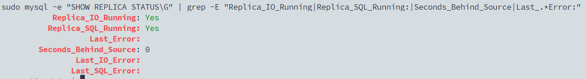
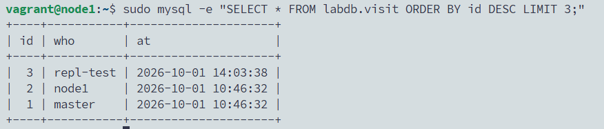
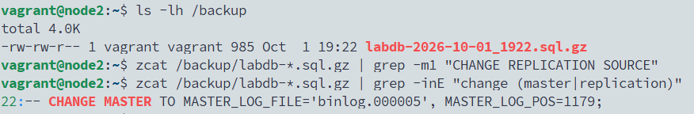
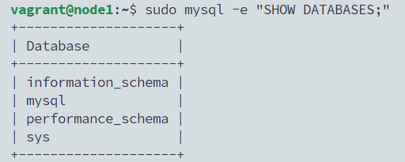
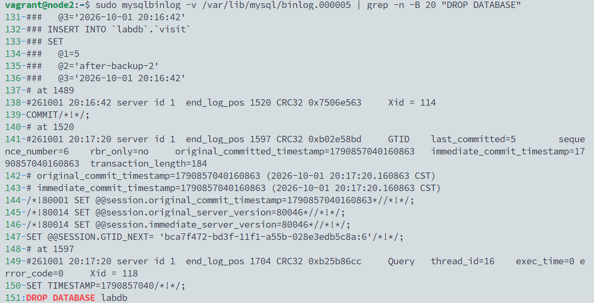
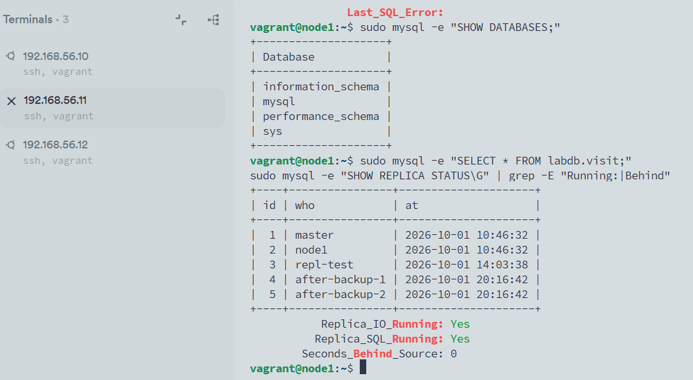
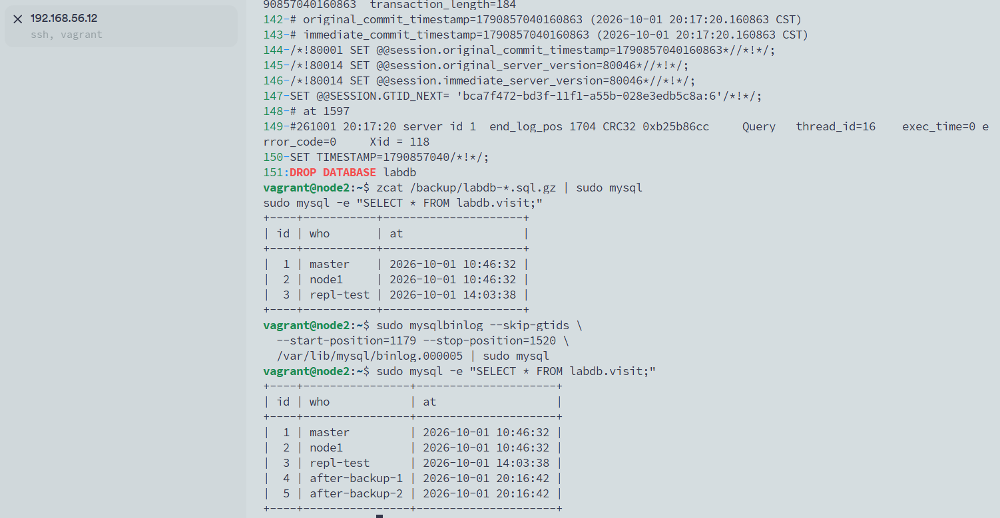

# 03 · MySQL 主从复制 + 备份与恢复

> 状态：✅ 已跑通（2026-10-01）

## 目标
在实验 02 的 MySQL 基础上做两件 DBA/运维的核心工作：

```
        写                     binlog 同步
master ───────▶ node2 主库 ─────────────────▶ node1 从库（只读）
                  │
                  │ mysqldump 每次全量 + binlog
                  ▼
            /backup  ──scp──▶ master:~/backup（异地副本）
```

1. **主从复制（GTID）**：主库写入，从库秒级同步；从库只读。
2. **备份与时间点恢复**：模拟 `DROP DATABASE` 误删，用“全量备份 + binlog”恢复到删库前一秒，一行数据都不丢。

**为什么重要：** “主从原理”“主从延迟/断了怎么办”“误删库怎么恢复”“复制能不能代替备份”是国内运维面试的 MySQL 必考题。本实验每个问题都亲手做一遍。

## 环境
| 主机 | 角色 | 本实验做什么 |
|------|------|--------------|
| node2 | **主库**（实验 02 已装 MySQL，有 labdb） | 开 GTID、建复制账号、做备份、演练误删恢复 |
| node1 | **从库** | 新装 MySQL，接上主库，设为只读 |
| master | 客户端 | 往主库写数据；保存备份副本 |

默认 light 档即可。node1 装 MySQL 时同样会“卡”几分钟（1G 内存），等它跑完，别 Ctrl+C。

> 本文档里的密码 `Repl@12345` 仅用于实验。

**原理先看懂（面试必背）：**
```
主库：事务提交 → 写 binlog
从库：IO 线程   拉取主库 binlog → 存成本地 relay log（中继日志）
      SQL 线程  回放 relay log → 数据和主库一致
```
**GTID** = 每个事务的全局唯一编号（`server_uuid:序号`）。从库记得自己执行到哪个编号，断了重连自动续上，不用手工找 binlog 文件名和位置。MySQL 8 新部署都推荐 GTID。

---

## A. 主从复制

### A1. 主库开启 GTID（node2）
不直接改 `mysqld.cnf`，单独建一个配置文件，改动一目了然：
```bash
sudo tee /etc/mysql/mysql.conf.d/replication.cnf >/dev/null <<'EOF'
[mysqld]
server-id                = 1
gtid_mode                = ON
enforce_gtid_consistency = ON
EOF
sudo systemctl restart mysql
sudo mysql -e "SELECT @@server_id, @@gtid_mode, @@log_bin, @@server_uuid;"
```
预期：`1  ON  1  一串uuid`。

| 参数 | 作用 |
|------|------|
| `server-id` | 复制集群里每台机器的编号，**必须不同** |
| `gtid_mode` / `enforce_gtid_consistency` | 开启 GTID，并禁止不安全的语句 |
| `log_bin` | binlog 开关，MySQL 8 **默认已开**，文件在 `/var/lib/mysql/binlog.00000N` |

`/etc/mysql/mysql.conf.d/` 下所有 `.cnf` 都会被自动加载，所以新文件不用额外引用。

### A2. 建复制账号（node2）
```bash
sudo mysql <<'EOF'
CREATE USER 'repl'@'192.168.56.11' IDENTIFIED BY 'Repl@12345';
GRANT REPLICATION SLAVE ON *.* TO 'repl'@'192.168.56.11';
SHOW BINARY LOGS;
EOF
```
复制账号只给 `REPLICATION SLAVE` 一个权限，且只允许从库 IP 登录——最小权限。

### A3. 导出主库现有数据（node2）
从库是空的，要先把主库已有的 labdb 搬过去，再从这个点开始同步：
```bash
sudo mysqldump --databases labdb --single-transaction --set-gtid-purged=ON \
  > /vagrant/labdb-init.sql
grep -m1 GTID_PURGED /vagrant/labdb-init.sql   # 记录了导出时主库执行到哪个 GTID
```
- `/vagrant` 是三台共享的目录（宿主机的 `00-lab-env`），用它在 node2 → node1 之间传文件。`*.sql` 已加入 `.gitignore`。
- `--single-transaction`：在一个一致性快照里导出 InnoDB 表，**不锁表**，业务可以照常写。
- `--set-gtid-purged=ON`：告诉从库“这些 GTID 的数据已经在文件里了”，从库接上后只要之后的事务。

### A4. 从库安装 MySQL 并导入（node1）
```bash
sudo apt-get install -y mysql-server     # 等它跑完，弹窗直接回车

sudo tee /etc/mysql/mysql.conf.d/replication.cnf >/dev/null <<'EOF'
[mysqld]
server-id                = 2
gtid_mode                = ON
enforce_gtid_consistency = ON
EOF
sudo systemctl restart mysql

sudo mysql < /vagrant/labdb-init.sql
sudo mysql -e "SELECT * FROM labdb.visit; SELECT @@gtid_executed;"
```
能看到实验 02 写入的数据(visit是之前手动创建的表)，`gtid_executed` 和主库导出时一致。

### A5. 接上主库并启动复制（node1）
```bash
sudo mysql <<'EOF'
CHANGE REPLICATION SOURCE TO
  SOURCE_HOST = '192.168.56.12',
  SOURCE_USER = 'repl',
  SOURCE_PASSWORD = 'Repl@12345',
  SOURCE_AUTO_POSITION = 1,
  GET_SOURCE_PUBLIC_KEY = 1;
START REPLICA;
EOF
sudo mysql -e "SHOW REPLICA STATUS\G" | grep -E "Replica_IO_Running|Replica_SQL_Running:|Seconds_Behind_Source|Last_.*Error:"
```
预期：
```
Replica_IO_Running: Yes
Replica_SQL_Running: Yes
Seconds_Behind_Source: 0
Last_IO_Error:        （空）
Last_SQL_Error:       （空）
```
- `SOURCE_AUTO_POSITION = 1`：按 GTID 自动定位，不用写 binlog 文件名和位置。
- `GET_SOURCE_PUBLIC_KEY = 1`：MySQL 8 默认密码插件 `caching_sha2_password` 在非 SSL 连接下需要它，否则 IO 线程报 `Authentication requires secure connection`。
- node1 有 ufw，但**不用放行**：是从库主动连主库的 3306（出站），ufw 默认放行出站。

**两个 Yes 是主从健康的标志，面试必问。** 哪个是 No 就看对应的 `Last_IO_Error` / `Last_SQL_Error`。

> 📸 截图：`SHOW REPLICA STATUS` 两个 Yes + `Seconds_Behind_Source: 0`


### A6. 验证同步（master → node2，node1 上看）
在 **master** 上往主库写：
```bash
mysql -h node2 -u app -p'App@12345' labdb -e "INSERT INTO visit (who) VALUES ('repl-test');"
```
在 **node1** 上马上查：
```bash
sudo mysql -e "SELECT * FROM labdb.visit ORDER BY id DESC LIMIT 3;"
```
能看到 `repl-test` 即同步成功。再在 master 上 `CREATE TABLE` 一张新表，node1 上 `SHOW TABLES` 也会出现——DDL 同样会复制。

> 📸 截图：master 写入，node1 查到 `repl-test`


### A7. 从库设为只读（node1）
从库被误写会和主库数据不一致，最终导致复制中断。生产上从库必须只读：
```bash
sudo tee -a /etc/mysql/mysql.conf.d/replication.cnf >/dev/null <<'EOF'
read_only       = ON
super_read_only = ON
EOF
sudo systemctl restart mysql
sudo mysql -e "INSERT INTO labdb.visit (who) VALUES ('write-on-replica');"
```
预期报错：`ERROR 1290 ... running with the --super-read-only option`。
- `read_only` 只拦普通用户；`super_read_only` 连 root 也拦。
- 复制线程不受影响：重启后复制会自动恢复，再跑一次 A5 的 `SHOW REPLICA STATUS` 确认两个 Yes。

> 📸 截图：从库写入被拒绝 ERROR 1290

---

## B. 备份与时间点恢复（node2）

**先记住一句话：复制不是备份。** 主库执行 `DROP DATABASE`，从库也会忠实地同步删除。

### B1. 全量备份
```bash
sudo mkdir -p /backup && sudo chown vagrant:vagrant /backup
sudo mysqldump --databases labdb --single-transaction --routines --triggers \
  --source-data=2 --set-gtid-purged=OFF \
  | gzip > /backup/labdb-$(date +%F_%H%M).sql.gz
ls -lh /backup
zcat /backup/labdb-*.sql.gz | grep -iE "change (master|replication)"
```
最后一行输出类似（Ubuntu 22.04 的 mysqldump 用旧写法 `CHANGE MASTER TO`，新版本是 `CHANGE REPLICATION SOURCE TO`，含义相同）：
```
-- CHANGE MASTER TO MASTER_LOG_FILE='binlog.000005', MASTER_LOG_POS=1179;
```
**记下这个文件名和位置**，它是“备份在 binlog 里的时间点”，恢复时从这里开始回放。

| 参数 | 作用 |
|------|------|
| `--source-data=2` | 在备份文件里以注释形式记录当时的 binlog 位置 |
| `--set-gtid-purged=OFF` | 不写 GTID 信息，这样备份能导回**同一台**已开 GTID 的库（和 A3 正好相反：A3 是给新从库用的），备份给新机器用ON,备份要导回原机器用OFF |
| `--routines --triggers` | 连存储过程、触发器一起备份 |

**异地副本**（备份和数据放在同一台机器，机器坏了一起没）。在 **master** 上：
```bash
mkdir -p ~/backup && scp node2:/backup/labdb-*.sql.gz ~/backup/ && ls -lh ~/backup
```

> 📸 截图：`/backup` 下的备份文件 + 备份里的 `CHANGE MASTER TO` 那一行


### B2. 备份后继续产生数据
在 **master** 上，模拟备份之后业务还在写：
```bash
mysql -h node2 -u app -p'App@12345' labdb -e "
INSERT INTO visit (who) VALUES ('after-backup-1'), ('after-backup-2');
SELECT * FROM visit;"
```
这两行**不在全量备份里**，只存在于 binlog 中。恢复的目标就是把它们也找回来。

### B3. 事故：误删库
在 **node2** 上：
```bash
sudo mysql -e "DROP DATABASE labdb;"
sudo mysql -e "FLUSH BINARY LOGS;"      # 切到新的 binlog 文件，让事故现场的文件不再增长
```
到 **node1** 看一眼：
```bash
sudo mysql -e "SHOW DATABASES;"          # labdb 也没了 —— 复制不是备份
```

> 📸 截图：node1 上 labdb 也消失了


### B4. 在 binlog 里找到删库的位置（node2）
```bash
sudo mysql -e "SHOW BINARY LOGS;"
# 在 B1 记下的那个 binlog 文件里找 DROP（文件名按你的实际情况改）
sudo mysqlbinlog -v /var/lib/mysql/binlog.000005 | grep -n -B 20 "DROP DATABASE"
```
输出里 `DROP DATABASE` 上方会有这样一段：
```
# at 2345
#261001 15:20:01 server id 1  end_log_pos 2422 ... GTID ...
SET @@SESSION.GTID_NEXT= 'xxxx:12'
# at 2422
#261001 15:20:01 server id 1  end_log_pos 2531 ... Query ...
DROP DATABASE labdb
```
**删库事务从它的 GTID 事件开始**，所以停止位置取 GTID 那一段上面的 `# at`（例子里是 `2345`）。


实际是#1520

### B5. 恢复：全量 + binlog 回放（node2）
```bash
# 1) 导入全量备份 —— 回到备份那一刻
zcat /backup/labdb-*.sql.gz | sudo mysql
sudo mysql -e "SELECT * FROM labdb.visit;"     # 此时还没有 after-backup-1/2

# 2) 回放 binlog：从备份位置到删库之前（数字换成你 B1、B4 记下的）
sudo mysqlbinlog --skip-gtids \
  --start-position=1179 --stop-position=1520 \
  /var/lib/mysql/binlog.000005 | sudo mysql

sudo mysql -e "SELECT * FROM labdb.visit;"     # after-backup-1/2 回来了
```
**为什么一定要 `--skip-gtids`（面试加分点）：** binlog 里每个事务都带着原来的 GTID，而这些 GTID 主库已经执行过，MySQL 会把它们当成“已执行”**静默跳过**——命令不报错，数据却没回来。去掉 GTID 后，它们会作为新事务执行。

如果备份位置和删库不在同一个 binlog 文件，就把多个文件按顺序一起传给 `mysqlbinlog`：第一个文件用 `--start-position`，最后一个文件用 `--stop-position`。

### B6. 看从库（node1）
恢复操作在主库上产生的是新事务，会自动复制到从库：
```bash
sudo mysql -e "SELECT * FROM labdb.visit;"
sudo mysql -e "SHOW REPLICA STATUS\G" | grep -E "Running:|Behind"
```
数据和主库一致，两个 Yes，说明这次恢复对主从都生效了。

> 📸 截图：恢复后 node2 和 node1 都能查到 `after-backup-1/2`


---

## 验证清单
- [x] node1 `SHOW REPLICA STATUS`：IO/SQL 两个 Yes，延迟 0
- [x] master 往主库写，node1 立刻能查到
- [x] 从库写入报 ERROR 1290（super_read_only）
- [x] `/backup` 有压缩备份，master `~/backup` 有异地副本
- [x] 误删库后用“全量 + binlog”恢复，`after-backup-1/2` 没丢，从库同步恢复

## 故障演练（选做，推荐）
1. **从库宕机追数据：** node1 `sudo systemctl stop mysql`，master 往主库插几行，再启动 node1 的 MySQL —— 复制自动续上，数据补齐。说明 GTID 自动定位的作用。
2. **主键冲突导致 SQL 线程停止：** 在 node1 上 `STOP REPLICA; SET GLOBAL super_read_only=OFF;`，手工插入一行 `id=100`；再在主库插入 `id=100`。`START REPLICA` 后 `Replica_SQL_Running: No`，`Last_SQL_Error` 报 1062 Duplicate entry。修复：删掉从库那一行，`START REPLICA`，最后把 `super_read_only` 改回 ON。这就是“从库为什么必须只读”。
3. **复制账号密码错误：** 用错误密码重新 `CHANGE REPLICATION SOURCE TO`，看 `Replica_IO_Running: Connecting` 和 `Last_IO_Error`。

每个按 [故障模板](../_templates/incident.md) 在 `troubleshooting/` 写一篇复盘。

## 踩坑记录
| 现象 | 原因 | 解决 |
|------|------|------|
| `replication.cnf` 末尾多了一行 `;` | 手误 | 无害（`;` 开头在 MySQL 配置里是注释）；`sudo sed -i '/^;$/d' 文件` 删除 |
| 备份里 grep 不到 `CHANGE REPLICATION SOURCE` | Ubuntu 22.04 的 mysqldump 仍写旧语法 `CHANGE MASTER TO` | `grep -iE "change (master\|replication)"`；文档已修正 |

（遇到报错把完整输出贴给 Claude，修正后记到这里）

## 回滚 / 清理
主从结构后面可以保留（Prometheus 实验可以监控复制延迟）。只想拆掉复制时，在 node1 上：
```bash
sudo mysql -e "STOP REPLICA; RESET REPLICA ALL;"
```
完全重来：`vagrant snapshot restore node1 base`（node2 回到 base 会丢掉实验 02 的成果，慎用）。

## 简历表述
> 搭建基于 GTID 的 MySQL 8.0 主从复制（从库 super_read_only），能通过 `SHOW REPLICA STATUS` 排查 IO/SQL 线程中断；使用 mysqldump + binlog 实现时间点恢复，完成误删库演练，并实施备份异地保存。
