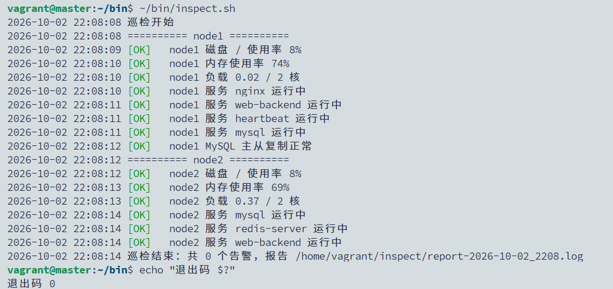
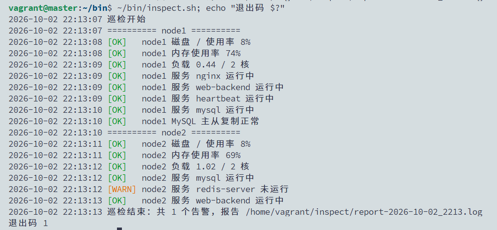
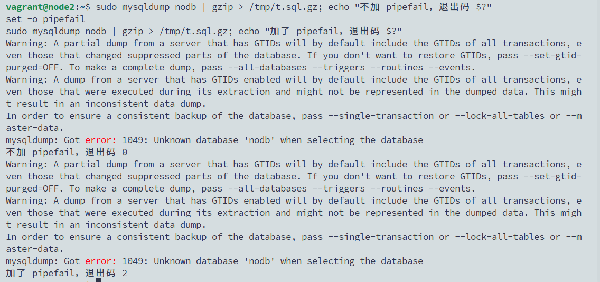

# 04 · Shell 脚本实战：服务器巡检 + cron 定时执行

> 状态：📝 文档已写，待验证

## 目标
写两个运维日常真的会用的脚本，并让它们自动定时运行：

| 脚本 | 跑在哪 | 做什么 |
|------|--------|--------|
| `inspect.sh` 巡检脚本 | master | ssh 到 node1、node2，检查磁盘、内存、负载、关键服务、MySQL 主从；超阈值标 `[WARN]`，写报告，有告警时退出码为 1 |
| `mysql-backup.sh` 备份脚本 | node2 | 把实验 03 手敲的 mysqldump 变成脚本：压缩、校验、只保留 7 天 |

然后用 **cron** 让巡检每 5 分钟跑一次、备份每天凌晨 2 点跑一次。

**为什么重要：** 运维岗笔试/面试几乎必有“写一个检查磁盘/服务的脚本”。巡检和定时备份也是入职后最先接手的活。后面学 Ansible 和 Prometheus 时，你会更清楚它们替代了脚本的哪部分。

## 环境
| 主机 | 本实验做什么 |
|------|--------------|
| master | 写巡检脚本，通过 ssh 检查两台 node（用实验 00 配好的免密） |
| node1 | 被巡检：nginx、web-backend、heartbeat、MySQL 从库 |
| node2 | 被巡检：mysql、redis-server、web-backend；写备份脚本 |

默认 light 档即可。不需要装任何新软件。

**本实验会用到的 Shell 知识点：**
| 知识点 | 脚本里的例子 |
|--------|--------------|
| 变量、数组、关联数组 | `DISK_WARN=80`、`HOSTS=(node1 node2)`、`SERVICES[node1]=...` |
| 函数、局部变量 | `check_host() { local h=$1; ... }` |
| 命令替换 | `disk=$(ssh "$h" df ...)` |
| 判断 | `if (( disk >= DISK_WARN ))`、`if ssh ... systemctl is-active` |
| 循环 | `for h in "${HOSTS[@]}"` |
| 退出码 | `$?`、`exit 1`、`set -euo pipefail` |

---

## A. 巡检脚本（master）

### A1. 先手动敲一遍要用的命令
脚本就是把手敲的命令串起来。先在 **master** 上逐条试，看清每条输出什么：
```bash
ssh node2 df --output=pcent /                       # 根分区使用率，如 " 9%"
ssh node2 df --output=pcent / | tail -1 | tr -dc '0-9'; echo   # 只留数字：9
ssh node2 free                                      # Mem 行：total used free shared buff/cache available
ssh node2 free | awk '/^Mem:/{printf "%d\n", ($2-$7)*100/$2}' # 已用内存 % = (total - available) / total
ssh node2 cat /proc/loadavg                         # 前 3 个数：1、5、15 分钟平均负载
ssh node2 nproc                                     # CPU 核数
ssh node2 systemctl is-active redis-server; echo "退出码 $?"     # active / 退出码 0
ssh node2 systemctl is-active not-exist;   echo "退出码 $?"     # inactive / 退出码非 0
```
**两个关键点：**
- `ssh node2 命令 | 管道`：命令在 node2 上执行，**管道后面在 master 上执行**。所以 `awk`、`tr` 都在本地处理，不用在 ssh 里写复杂的引号。
- 判断“成功/失败”看**退出码**：`0` 是成功，非 `0` 是失败。`if` 判断的就是退出码，不是输出的文字。

### A2. 写脚本
在 **master** 上：
```bash
mkdir -p ~/bin
vim ~/bin/inspect.sh
```
内容如下（建议自己敲，边敲边对照注释理解）：
```bash
#!/usr/bin/env bash
# inspect.sh —— 巡检 node1/node2：磁盘、内存、负载、关键服务、MySQL 主从
# 用法：inspect.sh        退出码：0 全部正常；1 有告警
set -uo pipefail          # 不用 -e：某一项检查失败也要继续往下查

# ---------- 配置 ----------
HOSTS=(node1 node2)
DISK_WARN=80              # 磁盘使用率告警阈值（%）
MEM_WARN=90               # 内存使用率告警阈值（%）
declare -A SERVICES=(     # 每台要检查的服务
  [node1]="nginx web-backend heartbeat mysql"
  [node2]="mysql redis-server web-backend"
)
REPORT_DIR="$HOME/inspect"
REPORT="$REPORT_DIR/report-$(date +%F_%H%M).log"
KEEP_DAYS=7               # 报告保留天数
WARN_COUNT=0

# ---------- 工具函数 ----------
log()  { echo "$(date '+%F %T') $*" | tee -a "$REPORT"; }
ok()   { log "[OK]   $*"; }
warn() { log "[WARN] $*"; WARN_COUNT=$((WARN_COUNT + 1)); }

# ---------- 检查一台机器 ----------
check_host() {
  local h=$1
  log "========== $h =========="

  # 1. 能不能连上：连不上后面都不用查了
  if ! ssh -o ConnectTimeout=5 -o BatchMode=yes "$h" true 2>/dev/null; then
    warn "$h SSH 连接失败"
    return 1
  fi

  # 2. 磁盘
  local disk
  disk=$(ssh "$h" df --output=pcent / | tail -1 | tr -dc '0-9')
  if (( disk >= DISK_WARN )); then
    warn "$h 磁盘 / 使用率 ${disk}%（阈值 ${DISK_WARN}%）"
  else
    ok "$h 磁盘 / 使用率 ${disk}%"
  fi

  # 3. 内存
  local mem
  mem=$(ssh "$h" free | awk '/^Mem:/{printf "%d", ($2-$7)*100/$2}')
  if (( mem >= MEM_WARN )); then
    warn "$h 内存使用率 ${mem}%（阈值 ${MEM_WARN}%）"
  else
    ok "$h 内存使用率 ${mem}%"
  fi

  # 4. 负载：1 分钟负载超过 CPU 核数算高。bash 不能比较小数，交给 awk
  local load cores
  load=$(ssh "$h" cat /proc/loadavg | cut -d' ' -f1)
  cores=$(ssh "$h" nproc)
  if awk -v l="$load" -v c="$cores" 'BEGIN { exit !(l > c) }'; then
    warn "$h 负载 ${load} 超过核数 ${cores}"
  else
    ok "$h 负载 ${load} / ${cores} 核"
  fi

  # 5. 服务
  local svc
  for svc in ${SERVICES[$h]:-}; do
    if ssh "$h" systemctl is-active --quiet "$svc"; then
      ok "$h 服务 $svc 运行中"
    else
      warn "$h 服务 $svc 未运行"
    fi
  done

  # 6. MySQL 从库：IO、SQL 两个线程都要是 Yes
  if [[ $h == node1 ]]; then
    local yes_count
    yes_count=$(ssh "$h" "sudo mysql -e 'SHOW REPLICA STATUS\G'" | grep -c "Running: Yes")
    if (( yes_count == 2 )); then
      ok "$h MySQL 主从复制正常"
    else
      warn "$h MySQL 主从复制异常（Yes 数量 $yes_count/2）"
    fi
  fi
}

# ---------- 主流程 ----------
main() {
  mkdir -p "$REPORT_DIR"
  log "巡检开始"
  local h
  for h in "${HOSTS[@]}"; do
    check_host "$h"
  done
  log "巡检结束：共 $WARN_COUNT 个告警，报告 $REPORT"

  # 清理 7 天前的旧报告，防止把磁盘写满
  find "$REPORT_DIR" -name 'report-*.log' -mtime +"$KEEP_DAYS" -delete

  if (( WARN_COUNT > 0 )); then
    exit 1
  fi
  exit 0
}

main "$@"
```
```bash
chmod +x ~/bin/inspect.sh
bash -n ~/bin/inspect.sh && echo 语法OK     # -n 只检查语法，不执行
```

**几处“为什么这样写”：**
| 写法 | 原因 |
|------|------|
| `set -uo pipefail` | `-u`：用了未定义的变量就报错（防手误）；`pipefail`：管道里任何一步失败，整条管道算失败。故意不加 `-e`，否则一项检查失败整个脚本就退出了 |
| `-o BatchMode=yes` | 免密失效时直接报错，不会卡在输入密码的提示上（cron 里没人输密码） |
| `"$h"`、`"$svc"` 加双引号 | 变量值里有空格时不会被拆开，好习惯 |
| `${SERVICES[$h]:-}` | 某台机器没配服务时取空值，不会被 `set -u` 判成错误 |
| 结尾 `exit 1` | 让别的程序（cron、Jenkins、监控）能通过退出码知道“有问题” |

### A3. 手动运行
在 **master** 上：
```bash
~/bin/inspect.sh
echo "退出码 $?"
ls ~/inspect/
```
预期：每项都是 `[OK]`，最后 `共 0 个告警`，退出码 `0`。

> 📸 截图：巡检输出全 OK + 退出码 0


### A4. 制造告警
在 **node2** 上停掉 Redis：
```bash
sudo systemctl stop redis-server
```
回 **master** 再跑：
```bash
~/bin/inspect.sh; echo "退出码 $?"
```
预期出现 `[WARN] node2 服务 redis-server 未运行`，退出码 `1`。

再试磁盘告警：把脚本里 `DISK_WARN=80` 临时改成 `5`，再跑一次，两台都会报磁盘告警。**试完改回 80**，并在 node2 上 `sudo systemctl start redis-server`。

> 📸 截图：出现 `[WARN]` + 退出码 1

---

## B. 定时备份脚本（node2）

### B1. 写脚本
把实验 03 B1 手敲的备份命令写成脚本。在 **node2** 上：
```bash
sudo vim /usr/local/bin/mysql-backup.sh
```
```bash
#!/usr/bin/env bash
# mysql-backup.sh —— 全量备份 labdb：压缩、校验、只保留最近 7 天
set -euo pipefail         # 备份脚本任何一步出错就立刻停止，宁可失败也不能留下“假备份”

BACKUP_DIR=/backup
KEEP_DAYS=7
FILE="$BACKUP_DIR/labdb-$(date +%F_%H%M).sql.gz"
TMP="$FILE.tmp"
trap 'rm -f "$TMP"' EXIT  # 脚本无论成功还是中途失败，退出时都删掉临时文件

mysqldump --databases labdb --single-transaction --routines --triggers \
  --source-data=2 --set-gtid-purged=OFF | gzip > "$TMP"

gzip -t "$TMP"            # 校验压缩包完整，损坏则退出码非 0，脚本停止
mv "$TMP" "$FILE"         # 全部成功才改成正式文件名：/backup 里只会有完整的备份

find "$BACKUP_DIR" -name 'labdb-*.sql.gz' -mtime +"$KEEP_DAYS" -delete

echo "$(date '+%F %T') 备份成功：$FILE（$(du -h "$FILE" | cut -f1)）"
```
```bash
sudo chmod +x /usr/local/bin/mysql-backup.sh
sudo /usr/local/bin/mysql-backup.sh
ls -lh /backup
```
脚本以 root 运行（`sudo`），所以 `mysqldump` 不用写密码——走的是实验 02 讲过的 `auth_socket`。

### B2. 为什么一定要 `pipefail`（面试高频）
在 **node2** 上做个对比，让 mysqldump 故意失败（库名写错）：
```bash
sudo mysqldump nodb | gzip > /tmp/t.sql.gz; echo "不加 pipefail，退出码 $?"
set -o pipefail
sudo mysqldump nodb | gzip > /tmp/t.sql.gz; echo "加了 pipefail，退出码 $?"
set +o pipefail
```
预期：第一次退出码 `0`，第二次非 `0`。
- 不加 `pipefail` 时，管道的退出码 = **最后一个命令**（gzip）的退出码。mysqldump 失败了，gzip 照样成功压缩了一个空内容，脚本以为备份成功——这就是“假备份”，等到要恢复时才发现文件是空的。

> 📸 截图：两次退出码对比

---

## C. cron 定时执行

### C1. cron 时间格式
```
┌───────── 分钟 (0-59)
│ ┌─────── 小时 (0-23)
│ │ ┌───── 日 (1-31)
│ │ │ ┌─── 月 (1-12)
│ │ │ │ ┌─ 星期 (0-7，0 和 7 都是周日)
│ │ │ │ │
* * * * *  要执行的命令
```
| 写法 | 含义 |
|------|------|
| `*/5 * * * *` | 每 5 分钟 |
| `0 2 * * *` | 每天 02:00 |
| `30 8 * * 1-5` | 工作日 08:30 |
| `0 */6 * * *` | 每 6 小时整点 |

记不住时可以去 crontab.guru 验证。cron 用的是系统时区，provision.sh 已经设成 Asia/Shanghai。

### C2. 巡检每 5 分钟跑一次（master）
在 **master** 上：
```bash
crontab -e            # 第一次会让选编辑器，选 vim 或 nano
```
在末尾加一行：
```
*/2 * * * * /home/vagrant/bin/inspect.sh > /dev/null 2>> /home/vagrant/inspect/cron-error.log
```
- 报告脚本自己会写，所以标准输出丢掉（`> /dev/null`）；**错误输出留下**，cron 出问题时靠它排查。
- 路径全部写**绝对路径**：cron 的环境变量很少，不会加载你登录时的配置。

```bash
crontab -l            # 确认已保存
```
等 5 分钟后：
```bash
ls -lt ~/inspect/ | head          # 每 5 分钟多一份报告
sudo grep CRON /var/log/syslog | tail -5   # cron 的执行记录（syslog 普通用户无权读，要 sudo）
cat ~/inspect/cron-error.log               # 空 = cron 运行没有报错
```

> 📸 截图：`crontab -l` + `~/inspect` 下自动生成的多份报告

### C3. 备份每天 02:00 跑一次（node2）
系统级的定时任务放在 `/etc/cron.d/`，比 `sudo crontab -e` 更直观，文件还能被 Ansible 管理。在 **node2** 上：
```bash
sudo tee /etc/cron.d/mysql-backup >/dev/null <<'EOF'
# 每天 02:00 备份 labdb
0 2 * * * root /usr/local/bin/mysql-backup.sh >> /var/log/mysql-backup.log 2>&1
EOF
```
注意 `/etc/cron.d/` 里的格式比 `crontab -e` **多一列用户名**（这里是 `root`）。

**先验证能跑：** 把 `0 2 * * *` 临时改成 `*/2 * * * *`，等 2 分钟：
```bash
tail /var/log/mysql-backup.log    # 出现“备份成功”
ls -lh /backup
```
确认后**改回 `0 2 * * *`**。

> 📸 截图：`/var/log/mysql-backup.log` 里 cron 自动执行的“备份成功”

---

## 验证清单
- [ ] `inspect.sh` 手动运行全 OK，退出码 0
- [ ] 停掉 redis-server 后出现 `[WARN]`，退出码 1
- [ ] 能讲清 `pipefail`：不加时 mysqldump 失败但退出码仍为 0
- [ ] master 的 cron 每 5 分钟生成一份巡检报告
- [ ] node2 的 cron 能自动执行备份，日志里有“备份成功”

## 故障演练（选做，推荐）
1. **手动能跑、cron 里不跑：** 把 crontab 里的 `/home/vagrant/bin/inspect.sh` 改成 `inspect.sh`（相对路径），等 5 分钟，看 `cron-error.log` 报 `inspect.sh: not found`。原因：cron 的 PATH 只有 `/usr/bin:/bin`。这是 cron 最经典的坑。
2. **巡检发现主从中断：** 在 node1 上 `sudo mysql -e "STOP REPLICA;"`，跑巡检看到复制告警；`START REPLICA;` 恢复。
3. **备份失败要能被发现：** 在 node2 上 `sudo systemctl stop mysql`，手动跑备份脚本，看它报错退出，`/backup` 里没有多出新文件（`.tmp` 已被 trap 删掉）；再启动 MySQL。

每个按 [故障模板](../_templates/incident.md) 在 `troubleshooting/` 写一篇复盘。

## 踩坑记录
| 现象 | 原因 | 解决 |
|------|------|------|
| `grep CRON /var/log/syslog` 报 Permission denied | syslog 只有 root 和 adm 组可读 | 加 `sudo`；文档已修正 |
| syslog 里的 `CRON[...]: (vagrant) CMD (... cron-error.log)` 被误以为是错误 | 这只是 cron 的执行记录，命令里正好写了 cron-error.log 这个路径 | 真正的错误看 `cat ~/inspect/cron-error.log`，为空就是正常 |
| 合盖后巡检报告中断，唤醒后虚拟机时间不对 | 宿主机睡眠，虚拟机被冻结；cron 不补跑错过的任务 | 重启 timesyncd 校时，见 [00-lab-env 第 7 步](../00-lab-env/README.md)；需要补跑可用 anacron 或 systemd timer（`Persistent=true`） |

（遇到报错把完整输出贴给 Claude，修正后记到这里）

## 回滚 / 清理
巡检每 5 分钟跑一次会一直产生报告（7 天自动清理）。不想让它继续跑时：
```bash
crontab -e            # master：在那一行前加 # 注释掉
```
备份 cron 建议保留，后面 Ansible 实验会把这两个脚本改成自动下发。

## 简历表述
> 编写 Shell 巡检脚本，通过 SSH 批量检查多台服务器的磁盘、内存、负载、关键服务和 MySQL 主从状态，按阈值输出告警并通过退出码对接自动化；编写带校验和保留策略的 MySQL 定时备份脚本（pipefail 防止“假备份”），并用 cron 实现定时执行。
