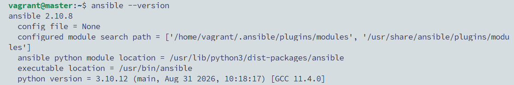
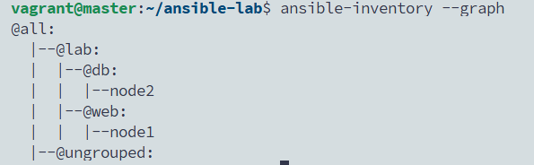
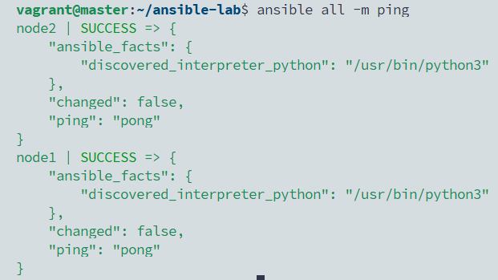
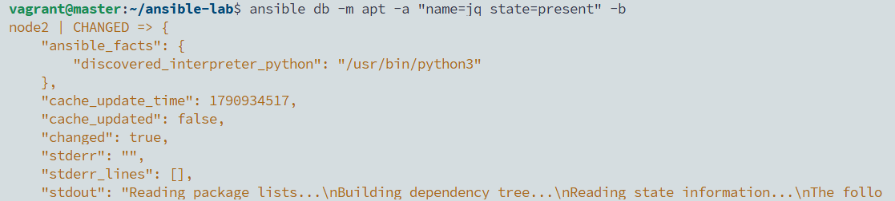
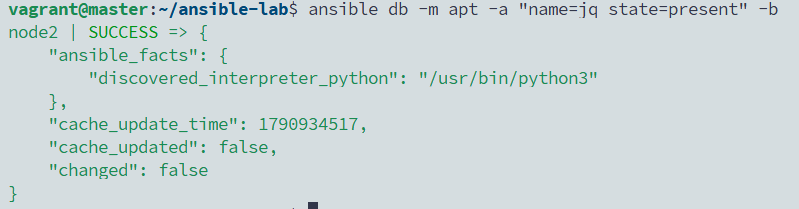
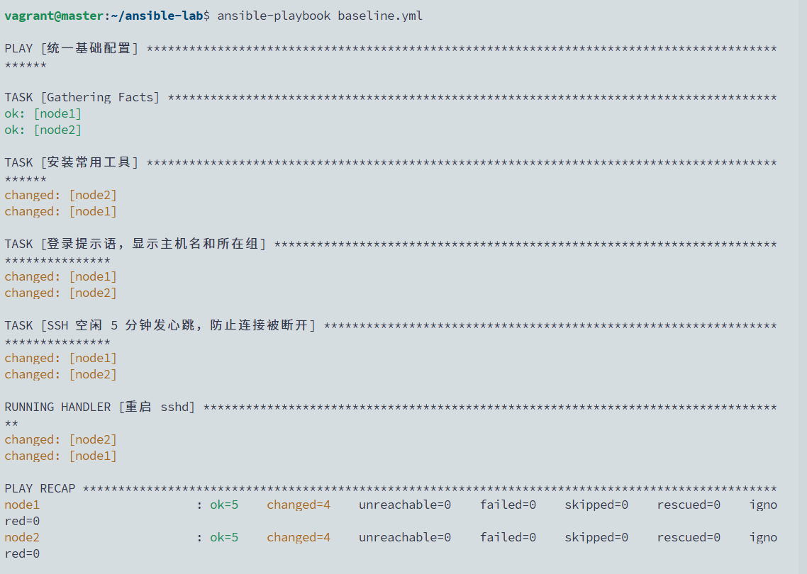
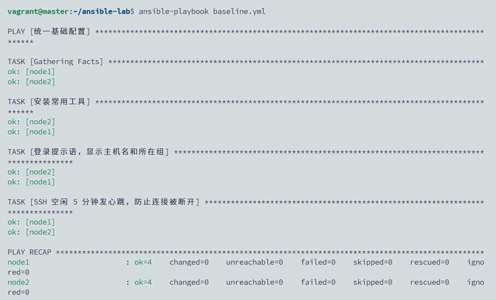

# 05 · Ansible 入门：inventory、ad-hoc、playbook

> 状态：✅ 已跑通（2026-10-03）

## 目标
在 master 上装好 Ansible，用它**一条命令同时管理 node1、node2**：

```
master（控制节点，装 Ansible）
   │ SSH（实验 00 配好的免密）—— 被管节点不用装任何客户端
   ├──▶ node1   [web 组]
   └──▶ node2   [db 组]
```

1. **inventory**：写清“管哪些机器、怎么分组”。
2. **ad-hoc**：一行命令批量执行，替代实验 04 里的 `for h in ...; do ssh ...` 循环。
3. **playbook**：把“统一基础配置”写成 YAML，**重复运行结果不变（幂等）**——第二次运行 `changed=0`。

**为什么重要：** Ansible 是国内运维招聘里出现频率最高的自动化工具。面试必问：ad-hoc 和 playbook 的区别、什么是幂等、`command` 和 `shell` 模块的区别、handler 什么时候触发。

## 环境
| 主机 | 角色 |
|------|------|
| master | 控制节点：装 Ansible，写 inventory 和 playbook，所有命令都在这里执行 |
| node1 | 被管节点，`web` 组 |
| node2 | 被管节点，`db` 组 |

默认 light 档即可。被管节点只需要 SSH 和 Python3（Ubuntu 自带），**不用装 agent**——这是 Ansible 和 SaltStack、Puppet 最大的区别。

> master 不放进 inventory：master 没有配置免密登录自己（见 CLAUDE.md），本实验只管两台 node。

---

## A. 安装和项目配置

### A1. 安装 Ansible
在 **master** 上：
```bash
sudo apt-get install -y ansible
ansible --version
```
Ubuntu 22.04 仓库里是 Ansible 2.10，走阿里云源，下载快。版本不是最新的，但本实验和实验 06 用到的功能都支持，命令写法和新版一样。

### A2. 建项目目录和 ansible.cfg
在 **master** 上：
```bash
mkdir -p ~/ansible-lab && cd ~/ansible-lab
cat > ansible.cfg <<'EOF'
[defaults]
inventory          = ./inventory.ini
remote_user        = vagrant
interpreter_python = auto_silent
forks              = 5
EOF
```
| 配置 | 作用 |
|------|------|
| `inventory` | 默认用哪个主机清单，以后命令里就不用写 `-i` |
| `remote_user` | 用哪个用户 SSH 到被管节点 |
| `interpreter_python = auto_silent` | 自动找被管节点的 Python，不打印提示 |
| `forks` | 同时操作几台机器（并发数） |

Ansible 会**优先读取当前目录的 `ansible.cfg`**，所以后面的命令都要在 `~/ansible-lab` 里执行。

### A3. 写 inventory（主机清单）
在 **master** 上（`~/ansible-lab` 目录）：
```bash
cat > inventory.ini <<'EOF'
[web]
node1

[db]
node2

[lab:children]
web
db
EOF
ansible-inventory --graph
```
预期：
```
@all:
  |--@lab:
  |  |--@db:
  |  |  |--node2
  |  |--@web:
  |  |  |--node1
  |--@ungrouped:
```
- `[web]`、`[db]` 是按用途分组；`[lab:children]` 是“组的组”，把两组合成一个大组。
- 写主机名就行，`/etc/hosts` 已经能解析（provision.sh 配的）。
- `all` 是 Ansible 自带的组，代表清单里所有机器。

> 📸 截图：`ansible --version` + `ansible-inventory --graph`


---

## B. ad-hoc：一行命令批量执行

格式：`ansible <主机或组> -m <模块> -a "<参数>" [-b]`

### B1. 连通性测试
在 **master** 上（`~/ansible-lab` 目录）：
```bash
ansible all -m ping
```
预期两台都返回 `"ping": "pong"`，颜色是绿色的 `SUCCESS`。
这里的 `ping` 不是网络 ping，而是“能 SSH 上去 + 能运行 Python”。

> 📸 截图：两台 `pong`


### B2. 批量执行命令
在 **master** 上（`~/ansible-lab` 目录）：
```bash
ansible all -m command -a "uptime"
ansible all -m command -a "df -h /"
ansible all -m shell   -a "free -m | grep Mem"
ansible all -m command -a "free -m | grep Mem"     # 故意用 command 跑管道
```
最后一条会报错。**`command` 和 `shell` 的区别（面试高频）：**
| 模块 | 能用管道 `\|`、重定向 `>`、变量 `$HOME` 吗 | 什么时候用 |
|------|------|------|
| `command`（默认模块） | 不能，直接执行程序，不经过 shell | 简单命令，更安全 |
| `shell` | 能，通过 `/bin/sh` 执行 | 必须用管道等 shell 特性时 |

对比实验 04：巡检两台机器的磁盘要写 `for` 循环 + ssh，这里一行 `ansible all -m command -a "df -h /"` 就够了，机器再多也一样。

### B3. 提权和幂等初体验
在 **master** 上（`~/ansible-lab` 目录）：
```bash
ansible db -m apt -a "name=jq state=present"            # 不加 -b
ansible db -m apt -a "name=jq state=present" -b         # 加 -b
ansible db -m apt -a "name=jq state=present" -b         # 再跑一次
```
1. 第一次报权限错误：装软件需要 root。`-b`（become）= 用 sudo 执行。
2. 第二次黄色 `CHANGED`：jq 装上了。
3. 第三次绿色 `SUCCESS`、`"changed": false`：模块先检查“jq 已经装了”，就什么也不做。

**这就是幂等：** 描述的是“最终状态”（jq 应该存在），而不是“动作”（去安装 jq）。跑多少次结果都一样。

> 📸 截图：同一条命令先 CHANGED 再 SUCCESS（changed: false）



### B4. 其他常用模块
在 **master** 上（`~/ansible-lab` 目录）：
```bash
ansible all -m copy -a "content='hello from ansible' dest=/tmp/hello.txt"
ansible all -m command -a "cat /tmp/hello.txt"
ansible web -m service -a "name=nginx state=started" -b        # 已经在运行 → changed: false
ansible node1 -m setup -a "filter=ansible_memtotal_mb"         # 收集主机信息（facts）
ansible all -m setup -a "filter=ansible_distribution*"
```
`setup` 模块收集的信息叫 **facts**（内存、IP、系统版本……），playbook 里可以直接当变量用。

---

## C. playbook：把配置写成代码

### C1. 写第一个 playbook
目标：给两台 node 做一份“统一基础配置”，以后新加机器跑一遍就和现有机器一致。

在 **master** 上（`~/ansible-lab` 目录）：
```bash
vim baseline.yml
```
```yaml
---
- name: 统一基础配置
  hosts: lab
  become: true                      # 整个 play 都用 sudo

  vars:
    common_packages:
      - htop
      - tree
      - jq
      - sysstat

  tasks:
    - name: 安装常用工具
      ansible.builtin.apt:
        name: "{{ common_packages }}"
        state: present
        update_cache: true
        cache_valid_time: 3600      # 1 小时内更新过软件源就不再更新

    - name: 登录提示语，显示主机名和所在组
      ansible.builtin.copy:
        dest: /etc/motd
        content: |
          ==========================================
           {{ inventory_hostname }}  [{{ group_names | join(',') }}]
           由 Ansible 管理，手工修改会被覆盖
          ==========================================
        mode: "0644"

    - name: SSH 空闲 5 分钟发心跳，防止连接被断开
      ansible.builtin.lineinfile:
        path: /etc/ssh/sshd_config
        regexp: '^#?ClientAliveInterval'
        line: 'ClientAliveInterval 300'
        validate: /usr/sbin/sshd -t -f %s   # 先检查新配置语法，错了就不写入
      notify: 重启 sshd

  handlers:
    - name: 重启 sshd
      ansible.builtin.service:
        name: ssh
        state: restarted
```
**YAML 注意：** 缩进只能用**空格**，不能用 Tab；同一层级的缩进必须对齐。

**几个概念：**
| 概念 | 在上面的哪里 | 说明 |
|------|------|------|
| play | `- name: 统一基础配置` 那一整段 | 对哪些主机（`hosts`）执行哪些任务 |
| task | `tasks:` 下的每一项 | 调用一个模块，`name` 写清楚做什么 |
| 变量 | `vars:` 和 `{{ }}` | `inventory_hostname`、`group_names` 是 Ansible 自带的变量 |
| handler | `handlers:` | **只有被 notify 且该任务 changed 时**才执行，而且在所有 task 结束后只执行一次 |
| `validate` | sshd 那一步 | 改 sshd 配置的保险：语法错了不写入，避免把自己锁在门外 |

### C2. 运行前先检查
在 **master** 上（`~/ansible-lab` 目录）：
```bash
ansible-playbook baseline.yml --syntax-check       # 只检查语法
ansible-playbook baseline.yml --check --diff       # 演练：显示会改什么，但不真改
```
`--check --diff` 相当于“预览”，生产环境改配置前必做。

### C3. 第一次运行
在 **master** 上（`~/ansible-lab` 目录）：
```bash
ansible-playbook baseline.yml
```
看最后的 **PLAY RECAP**：
```
node1 : ok=5  changed=4  unreachable=0  failed=0 ...
node2 : ok=5  changed=4  unreachable=0  failed=0 ...
```
数字不一定完全一样，关键是 **`changed` 不为 0、`failed=0`**。（ok 包含收集 facts、3 个 task 和 handler；handler 执行了也算一次 changed。）
- `htop`、`tree` 在 provision.sh 里已经装过，jq 在 B3 已经装到 node2 上——模块只装缺的那部分。
- `RUNNING HANDLER [重启 sshd]` 出现了：因为 sshd 配置这一步 changed，触发了 handler。

> 📸 截图：第一次运行的 PLAY RECAP（有 changed）


### C4. 第二次运行：验证幂等
在 **master** 上（`~/ansible-lab` 目录）：
```bash
ansible-playbook baseline.yml
```
预期：两台都是 **`changed=0`**，handler 也没有执行（配置没变，就不用重启 sshd）。

> 📸 截图：第二次运行 `changed=0`


再登录看看效果。在 **master** 上：
```bash
ssh node1          # 登录时能看到 motd 提示语
exit
```

### C5. 反例：不幂等的写法
在 **master** 上（`~/ansible-lab` 目录），连跑两次：
```bash
ansible all -m shell -a "echo 'export EDITOR=vim' >> ~/.bashrc"
ansible all -m shell -a "echo 'export EDITOR=vim' >> ~/.bashrc"
ansible all -m command -a "grep -c EDITOR /home/vagrant/.bashrc"   # 每台都是 2：重复追加了
```
`shell` 模块只会“执行动作”，每次都报 changed，跑几次就追加几次。
用模块描述“最终状态”才是幂等的。在 **master** 上（`~/ansible-lab` 目录）：
```bash
ansible all -m lineinfile -a "path=/home/vagrant/.bashrc line='export EDITOR=vim'"   # 这一行已存在 → changed: false，不会再加
```
**原则：能用模块就不用 `shell`/`command`。** 实在要用，配合 `creates`、`changed_when` 等参数让它幂等（实验 06 会用到）。

清理重复的那两行。在 **master** 上（`~/ansible-lab` 目录）：
```bash
ansible all -m lineinfile -a "path=/home/vagrant/.bashrc line='export EDITOR=vim' state=absent"
```

---

## 验证清单
- [x] `ansible-inventory --graph` 显示 web、db 两组
- [x] `ansible all -m ping` 两台 pong
- [x] 能说清 `command` 和 `shell` 的区别
- [x] `baseline.yml` 第一次运行有 changed，并触发了 handler
- [x] 第二次运行两台都是 `changed=0`
- [x] 能说清什么是幂等，以及为什么 `shell: echo >> 文件` 不幂等

## 故障演练（选做，推荐）
1. **主机连不上：** 在 inventory 的 `[web]` 下加一行 `node3`，执行 `ansible all -m ping`，看 `UNREACHABLE` 和报错信息；删掉这一行。
2. **YAML 缩进错误：** 把 `baseline.yml` 里某个 task 的 `name:` 多缩进两格，执行 `--syntax-check` 看报错提示的行号。
3. **validate 拦住错误配置：** 在 **master** 上（`~/ansible-lab` 目录）：
   - `vim baseline.yml`，把 sshd 那个 task 里的 `line: 'ClientAliveInterval 300'` 改成 `line: 'ClientAliveInterval abc'`
   - `ansible-playbook baseline.yml` → 这个 task 红色 FAILED，报错里有 sshd 检查不通过的信息
   - `ansible all -b -m command -a "grep ClientAliveInterval /etc/ssh/sshd_config"` → 仍然是 300，说明没被改坏；`ansible all -m ping` 照样能连
   - 把 `abc` 改回 `300`

   原理：`validate` 先把新内容写进临时文件，用 `sshd -t` 检查，通过了才替换真正的配置文件。

每个按 [故障模板](../_templates/incident.md) 在 `troubleshooting/` 写一篇复盘。

## 踩坑记录
| 现象 | 原因 | 解决 |
|------|------|------|
| | | |

（遇到报错把完整输出贴给 Claude，修正后记到这里）

## 回滚 / 清理
本实验的改动都很小（几个工具包、motd、一行 sshd 配置），**不用清理**。`~/ansible-lab` 保留，实验 06 在此基础上把实验 01、02 改造成 role。

## 面试题速答
**1. Ansible 有什么特点？和 SaltStack、Puppet 有什么区别？**
Ansible 是**无 agent** 的：被管节点只需要 SSH 和 Python，不用安装客户端；控制节点通过 SSH 把任务推送过去执行（push 模式）。配置用 YAML 编写，上手简单；模块大多是幂等的。SaltStack、Puppet 需要在每台机器上安装 agent。（环境一节）

**2. ad-hoc 和 playbook 有什么区别？**
ad-hoc 是一行命令执行一个模块，适合临时操作，比如批量查看磁盘、重启某个服务（B 部分）。playbook 是写在 YAML 文件里的一组任务，可以保存、复用、提交到 Git，适合需要反复执行的配置（C 部分）。

**3. 什么是幂等？**
同一个操作执行一次和执行多次，最终结果完全一样。Ansible 的模块描述的是“最终状态”（软件应该已安装），而不是“动作”（去安装软件）：执行前先检查，已经是目标状态就什么也不做。所以第二次运行 playbook 时 `changed=0`。（B3、C4）

**4. command 和 shell 模块有什么区别？**
`command` 直接执行程序，不经过 shell，不能使用管道 `|`、重定向 `>`、变量 `$HOME`、`~`，但更安全；`shell` 通过 `/bin/sh` 执行，这些都能用。两者都不是幂等的，每次都报 changed，能用专门的模块就不用它们。（B2、C5）

**5. handler 什么时候执行？**
只有被 `notify` 的任务状态是 **changed** 时才会触发，并且在所有任务执行完之后才执行；多个任务通知同一个 handler，也只执行一次。典型用法是改了配置文件才重启服务，配置没变就不重启。（C1、C3、C4）

**6. 正式执行 playbook 之前怎么确认它会改什么？**
`--syntax-check` 只检查语法；`--check --diff` 进行演练，显示哪些文件会怎么改，但不真正修改。生产环境改配置前必须先做这一步。（C2）

**7. `become` 是什么？**
提权，相当于用 sudo 执行。命令行加 `-b`，或者在 playbook 里写 `become: true`。安装软件、修改系统配置都需要提权。（B3、C1）

## 简历表述
> 使用 Ansible 管理多台 Linux 服务器：编写 inventory 分组、ad-hoc 批量操作，以及带变量、handler、配置校验（validate）的 playbook 实现统一基础配置；理解并验证幂等性（重复执行 changed=0），使用 `--check --diff` 预演变更。
